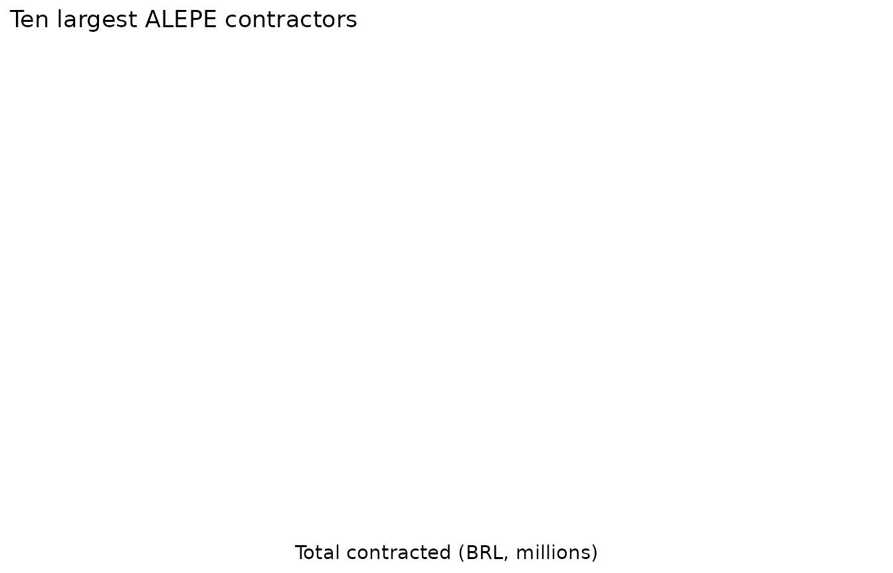
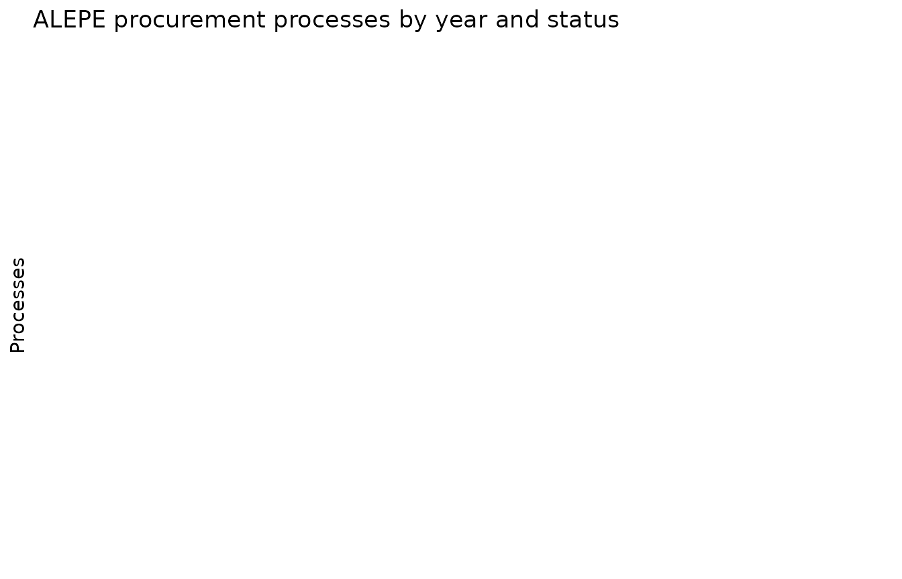

# Following the money: contracts and procurement

Public procurement data is where open legislative data meets social
accountability. This vignette explores the Assembly’s contracts and
bidding processes.

``` r

library(alepe)
library(dplyr)
library(ggplot2)
```

## Contract values by modality

``` r

contracts <- alepe_contracts()
#> Warning in alepe_contracts(): ! The ALEPE open data API could not be reached.
#> ℹ Returning `NULL`. Original error: Failed to perform HTTP request. Caused by
#>   error in `curl::curl_fetch_memory()`: ! Timeout was reached
#>   [dadosabertos.alepe.pe.gov.br]: Connection timed out after 30001 milliseconds
#> ℹ The service may be temporarily down; try again later.

contracts |>
  summarise(
    n = n(),
    total_brl = sum(valor, na.rm = TRUE),
    .by = modalidade
  ) |>
  arrange(desc(total_brl))
#> # A tibble: 0 × 3
#> # ℹ 3 variables: modalidade <chr>, n <int>, total_brl <dbl>
```

## Largest contractors

``` r

contracts |>
  summarise(total_brl = sum(valor, na.rm = TRUE), .by = contratada) |>
  slice_max(total_brl, n = 10) |>
  ggplot(aes(x = reorder(contratada, total_brl), y = total_brl / 1e6)) +
  geom_col(fill = "#e6550d") +
  coord_flip() +
  labs(
    x = NULL, y = "Total contracted (BRL, millions)",
    title = "Ten largest ALEPE contractors"
  ) +
  theme_minimal()
```



## Contracts active today

Validity dates are parsed to `Date`, so filtering active contracts is a
one-liner:

``` r

contracts |>
  filter(vigencia_inicio <= Sys.Date(), vigencia_fim >= Sys.Date()) |>
  select(contratada, objeto, valor, vigencia_fim) |>
  arrange(vigencia_fim)
#> # A tibble: 0 × 4
#> # ℹ 4 variables: contratada <chr>, objeto <chr>, valor <dbl>,
#> #   vigencia_fim <date>
```

## Procurement outcomes

``` r

procurements <- alepe_procurements()
#> Warning in alepe_procurements(): ! The ALEPE open data API could not be reached.
#> ℹ Returning `NULL`. Original error: Failed to perform HTTP request. Caused by
#>   error in `curl::curl_fetch_memory()`: ! Timeout was reached
#>   [dadosabertos.alepe.pe.gov.br]: Connection timed out after 30002 milliseconds
#> ℹ The service may be temporarily down; try again later.

procurements |>
  count(ano, status) |>
  ggplot(aes(x = ano, y = n, fill = status)) +
  geom_col() +
  labs(
    x = NULL, y = "Processes",
    fill = NULL,
    title = "ALEPE procurement processes by year and status"
  ) +
  theme_minimal() +
  theme(legend.position = "bottom") +
  guides(fill = guide_legend(ncol = 1))
```


