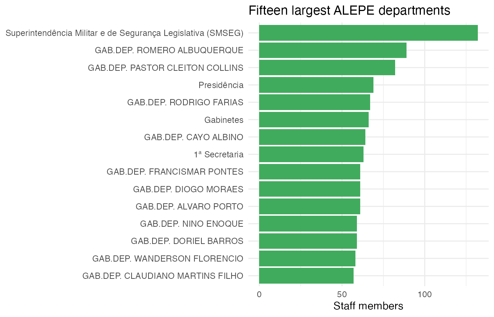

# Who works at ALEPE?

This vignette explores the composition of the Assembly’s workforce with
three endpoints:
[`alepe_staff()`](https://strategicprojects.github.io/alepe/reference/alepe_staff.md),
[`alepe_positions()`](https://strategicprojects.github.io/alepe/reference/alepe_positions.md),
and
[`alepe_departments()`](https://strategicprojects.github.io/alepe/reference/alepe_departments.md).

[`library`](https://rdrr.io/r/base/library.html)`(`[`alepe`](https://github.com/StrategicProjects/alepe)`)`` `[`library`](https://rdrr.io/r/base/library.html)`(`[`dplyr`](https://dplyr.tidyverse.org)`)`` `[`library`](https://rdrr.io/r/base/library.html)`(`[`ggplot2`](https://ggplot2.tidyverse.org)`)`

## Permanent vs. commissioned staff

`staff`` ``<-`` `[`alepe_staff`](https://strategicprojects.github.io/alepe/reference/alepe_staff.md)`(``)`` `` ``staff`` ``|>`` `` `[`count`](https://dplyr.tidyverse.org/reference/count.html)`(``vinculo``, sort ``=`` ``TRUE``)`` ``#> ``# A tibble: 3 × 2`` ``#> vinculo n`` ``#> ``<chr>`` ``<int>`` ``#> ``1`` Comissionado ``1``459`` ``#> ``2`` À Disposição 300`` ``#> ``3`` Efetivo 227`

Admission dates are parsed to `Date`, so the hiring history of the
current roster is easy to chart:

`staff`` ``|>`` `` `[`mutate`](https://dplyr.tidyverse.org/reference/mutate.html)`(``ano_admissao ``=`` `[`as.integer`](https://rdrr.io/r/base/integer.html)`(`[`format`](https://rdrr.io/r/base/format.html)`(``data_admissao``, ``"%Y"``)``)``)`` ``|>`` `` `[`count`](https://dplyr.tidyverse.org/reference/count.html)`(``ano_admissao``, ``vinculo``)`` ``|>`` `` `[`ggplot`](https://ggplot2.tidyverse.org/reference/ggplot.html)`(`[`aes`](https://ggplot2.tidyverse.org/reference/aes.html)`(``x ``=`` ``ano_admissao``, y ``=`` ``n``, fill ``=`` ``vinculo``)``)`` ``+`` `` `[`geom_col`](https://ggplot2.tidyverse.org/reference/geom_bar.html)`(``)`` ``+`` `` `[`labs`](https://ggplot2.tidyverse.org/reference/labs.html)`(`` `` x ``=`` ``"Year of admission"``, y ``=`` ``"Staff members"``,`` `` fill ``=`` ``NULL``,`` `` title ``=`` ``"Current ALEPE staff by year of admission"`` `` ``)`` ``+`` `` `[`theme_minimal`](https://ggplot2.tidyverse.org/reference/ggtheme.html)`(``)`

## Largest departments

`departments`` ``<-`` `[`alepe_departments`](https://strategicprojects.github.io/alepe/reference/alepe_departments.md)`(``)`

`departments`` ``|>`` `` `[`summarise`](https://dplyr.tidyverse.org/reference/summarise.html)`(``total ``=`` `[`sum`](https://rdrr.io/r/base/sum.html)`(``total``)``, .by ``=`` ``nome_lotacao``)`` ``|>`` `` `[`slice_max`](https://dplyr.tidyverse.org/reference/slice.html)`(``total``, n ``=`` ``15``)`` ``|>`` `` `[`ggplot`](https://ggplot2.tidyverse.org/reference/ggplot.html)`(`[`aes`](https://ggplot2.tidyverse.org/reference/aes.html)`(``x ``=`` `[`reorder`](https://rdrr.io/r/stats/reorder.factor.html)`(``nome_lotacao``, ``total``)``, y ``=`` ``total``)``)`` ``+`` `` `[`geom_col`](https://ggplot2.tidyverse.org/reference/geom_bar.html)`(``fill ``=`` ``"#41ab5d"``)`` ``+`` `` `[`coord_flip`](https://ggplot2.tidyverse.org/reference/coord_flip.html)`(``)`` ``+`` `` `[`labs`](https://ggplot2.tidyverse.org/reference/labs.html)`(`` `` x ``=`` ``NULL``, y ``=`` ``"Staff members"``,`` `` title ``=`` ``"Fifteen largest ALEPE departments"`` `` ``)`` ``+`` `` `[`theme_minimal`](https://ggplot2.tidyverse.org/reference/ggtheme.html)`(``)`

## Position structure

Career positions in the roster encode class and level in a single string
(`"ANALISTA LEGISLATIVO > CLASSE 1 > NÍVEL 10"`); a quick split reveals
the career ladder:

`positions`` ``<-`` `[`alepe_positions`](https://strategicprojects.github.io/alepe/reference/alepe_positions.md)`(``status ``=`` ``"permanent"``)`` `` ``positions`` ``|>`` `` ``tidyr``::`[`separate_wider_delim`](https://tidyr.tidyverse.org/reference/separate_wider_delim.html)`(`` `` ``cargo_nivel``,`` `` delim ``=`` ``" > "``,`` `` names ``=`` `[`c`](https://rdrr.io/r/base/c.html)`(``"career"``, ``"class"``, ``"level"``)``,`` `` too_few ``=`` ``"align_start"`` `` ``)`` ``|>`` `` `[`count`](https://dplyr.tidyverse.org/reference/count.html)`(``career``, wt ``=`` ``total``, sort ``=`` ``TRUE``)`` ``#> ``# A tibble: 24 × 2`` ``#> career n`` ``#> ``<chr>`` ``<int>`` ``#> `` 1`` TÉCNICO LEGISLATIVO 52`` ``#> `` 2`` ANALISTA LEGISLATIVO 49`` ``#> `` 3`` GERENTE 34`` ``#> `` 4`` ASSESSORAMENTO 24`` ``#> `` 5`` CHEFE DE DEPARTAMENTO 20`` ``#> `` 6`` POLICIAL LEGISLATIVO 9`` ``#> `` 7`` CHEFE DE EXPEDIENTE 6`` ``#> `` 8`` AGENTE LEGISLATIVO 5`` ``#> `` 9`` AUXILIAR DE SERVIÇOS 4`` ``#> ``10`` CONSULTOR CHEFE ADJUNTO DE NUCLEO 3`` ``#> ``# ℹ 14 more rows`
