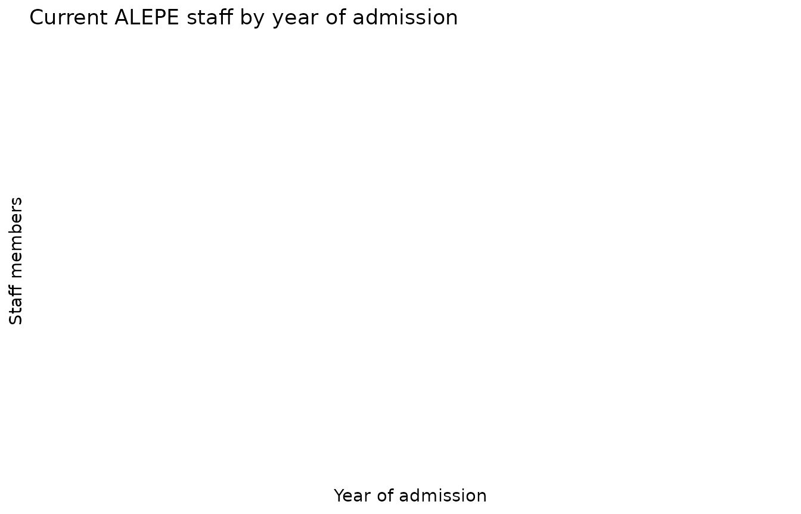
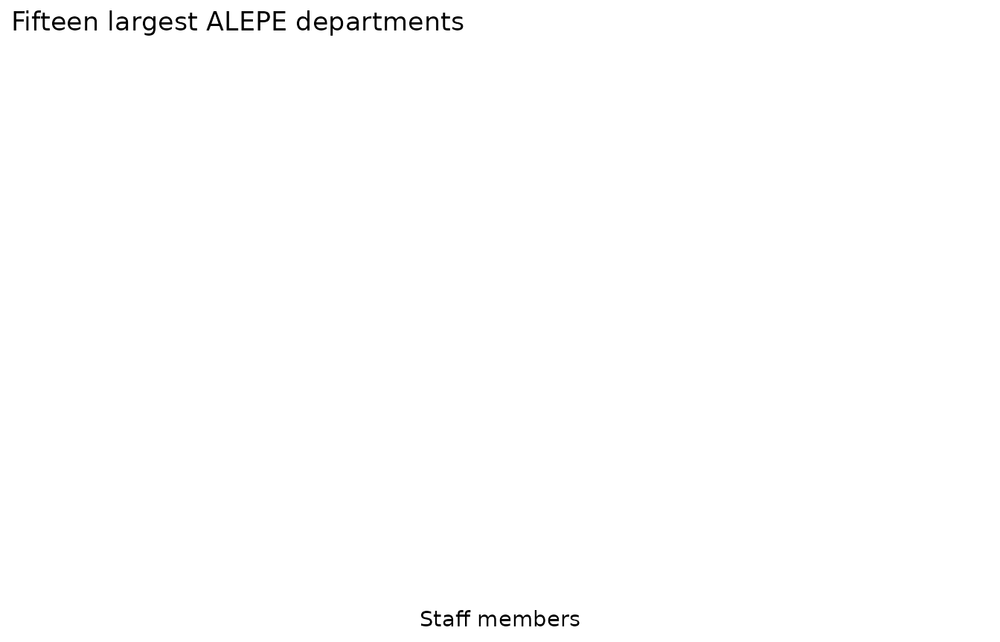

# Who works at ALEPE?

This vignette explores the composition of the Assembly’s workforce with
three endpoints:
[`alepe_staff()`](https://strategicprojects.github.io/alepe/reference/alepe_staff.md),
[`alepe_positions()`](https://strategicprojects.github.io/alepe/reference/alepe_positions.md),
and
[`alepe_departments()`](https://strategicprojects.github.io/alepe/reference/alepe_departments.md).

``` r

library(alepe)
library(dplyr)
library(ggplot2)
```

## Permanent vs. commissioned staff

``` r

staff <- alepe_staff()
#> Warning in alepe_staff(): ! The ALEPE open data API could not be reached.
#> ℹ Returning `NULL`. Original error: Failed to perform HTTP request. Caused by
#>   error in `curl::curl_fetch_memory()`: ! Timeout was reached
#>   [dadosabertos.alepe.pe.gov.br]: Connection timed out after 30001 milliseconds
#> ℹ The service may be temporarily down; try again later.

staff |>
  count(vinculo, sort = TRUE)
#> # A tibble: 0 × 2
#> # ℹ 2 variables: vinculo <chr>, n <int>
```

Admission dates are parsed to `Date`, so the hiring history of the
current roster is easy to chart:

``` r

staff |>
  mutate(ano_admissao = as.integer(format(data_admissao, "%Y"))) |>
  count(ano_admissao, vinculo) |>
  ggplot(aes(x = ano_admissao, y = n, fill = vinculo)) +
  geom_col() +
  labs(
    x = "Year of admission", y = "Staff members",
    fill = NULL,
    title = "Current ALEPE staff by year of admission"
  ) +
  theme_minimal()
```



## Largest departments

``` r

departments <- alepe_departments()
#> Warning in alepe_departments(): ! The ALEPE open data API could not be reached.
#> ℹ Returning `NULL`. Original error: Failed to perform HTTP request. Caused by
#>   error in `curl::curl_fetch_memory()`: ! Timeout was reached
#>   [dadosabertos.alepe.pe.gov.br]: Connection timed out after 30002 milliseconds
#> ℹ The service may be temporarily down; try again later.

departments |>
  summarise(total = sum(total), .by = nome_lotacao) |>
  slice_max(total, n = 15) |>
  ggplot(aes(x = reorder(nome_lotacao, total), y = total)) +
  geom_col(fill = "#41ab5d") +
  coord_flip() +
  labs(
    x = NULL, y = "Staff members",
    title = "Fifteen largest ALEPE departments"
  ) +
  theme_minimal()
```



## Position structure

Career positions in the roster encode class and level in a single string
(`"ANALISTA LEGISLATIVO > CLASSE 1 > NÍVEL 10"`); a quick split reveals
the career ladder:

``` r

positions <- alepe_positions(status = "permanent")
#> Warning in alepe_positions(status = "permanent"): ! The ALEPE open data API could not be reached.
#> ℹ Returning `NULL`. Original error: Failed to perform HTTP request. Caused by
#>   error in `curl::curl_fetch_memory()`: ! Timeout was reached
#>   [dadosabertos.alepe.pe.gov.br]: Connection timed out after 30002 milliseconds
#> ℹ The service may be temporarily down; try again later.

positions |>
  tidyr::separate_wider_delim(
    cargo_nivel,
    delim = " > ",
    names = c("career", "class", "level"),
    too_few = "align_start"
  ) |>
  count(career, wt = total, sort = TRUE)
#> # A tibble: 0 × 2
#> # ℹ 2 variables: career <chr>, n <int>
```
